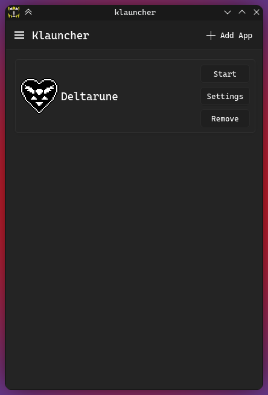
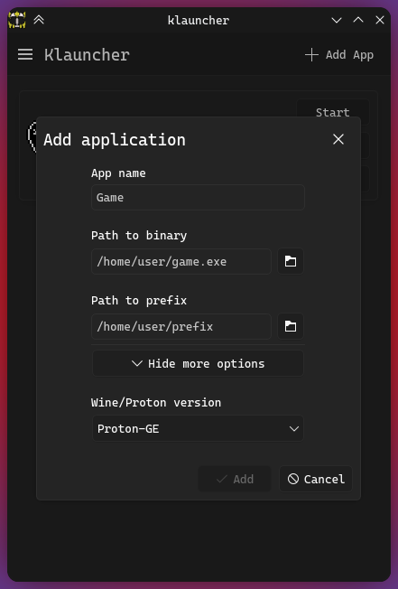
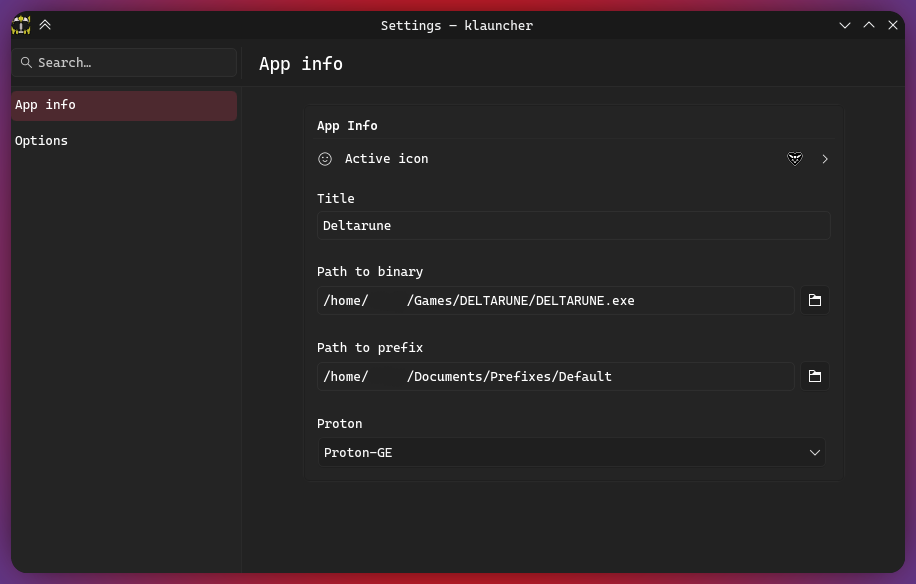
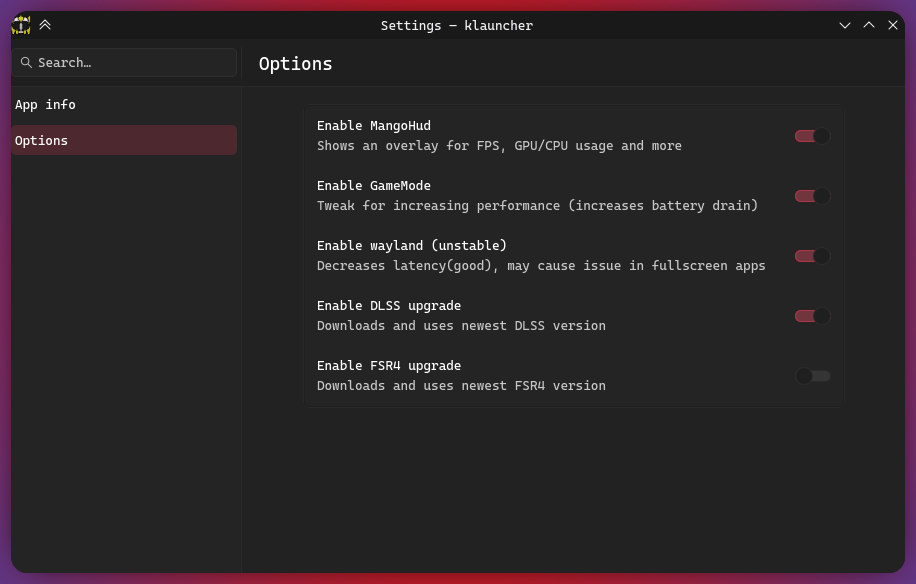
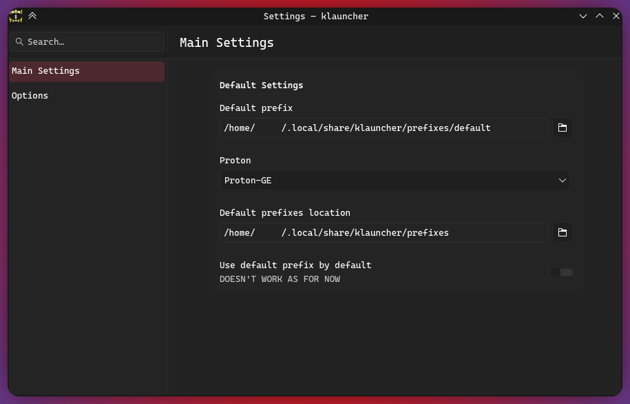

# Klauncher
A Qt/Kirigami proton launcher for linux

### Screenshots






### Installation

#### Requirements

- Dependencies

Arch Linux
```
sudo pacman -S --neede base-devel extra-cmake-modules cmake kirigami kirigami-addons ki18n kcoreaddons breeze kiconthemes qt6-base qt6-declarative qqc2-desktop-style umu-launcher icoutils
```

#### Any distro
if you want to install it to ~/.local change /usr to ~/.local

```bash
git clone https://github.com/KamiNuke/Klauncher
cd klauncher
cmake -B build/ -G Ninja -DCMAKE_BUILD_TYPE=Release --install-prefix /usr
cmake --build build --parallel
sudo cmake --install build
```

#### Arch Linux
```bash
mkdir klauncher && cd klauncher
wget https://raw.githubusercontent.com/KamiNuke/Klauncher/refs/heads/main/PKGBUILD
makepkg -si
```

